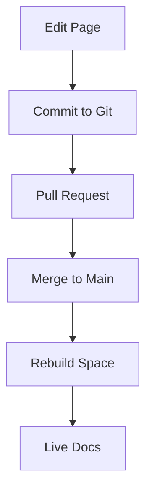

## Overview

Inuba organizes your project documentation into flexible structures that scale with your needs. You manage everything from high-level spaces down to individual pages using intuitive tools. These core concepts—documentation spaces, content organization, and version control—form the foundation of effective documentation workflows.

<Columns cols={3}>
  <Card title="Documentation Spaces" icon="folder" href="#documentation-spaces">
    Group related docs into isolated spaces for teams or projects.
  </Card>
  <Card title="Content Organization" icon="layout" href="#content-organization">
    Structure pages with hierarchies, navigation, and search.
  </Card>
  <Card title="Version Control" icon="git-branch" href="#version-control">
    Track changes with Git integration for collaboration.
  </Card>
</Columns>

## Documentation Spaces

Documentation spaces act as top-level containers in Inuba. You create a space for each project, team, or product to keep content isolated and permissions granular.

<Callout kind="info">
  Each space supports unlimited pages and custom branding, like your brand color `#3B82F6`.
</Callout>

<Tabs>
  <Tab title="Create a Space" icon="plus">
    Follow these steps to set up your first space:

    <Steps>
      <Step title="Navigate to Spaces" icon="search">
        Click the spaces menu in the sidebar.
      </Step>
      <Step title="Add New Space" icon="plus-circle">
        Select `Create Space` and enter a name like `API Docs`.
      </Step>
      <Step title="Configure Settings" icon="settings">
        Set permissions and apply your brand color.
      </Step>
    </Steps>
  </Tab>
  <Tab title="Manage Spaces" icon="settings">
    Use the dashboard to archive or duplicate spaces.

    ```javascript
    // Example API call to list spaces
    const spaces = await fetch('/api/spaces', {
      headers: { Authorization: `Bearer ${API_TOKEN}` }
    }).then(res => res.json());
    ```
  </Tab>
</Tabs>

## Content Organization

You structure content within spaces using pages, sections, and navigation menus. This hierarchy ensures users find information quickly.

| Element       | Purpose                          | Example Use                  |
|---------------|----------------------------------|------------------------------|
| Page          | Individual document              | `quickstart.mdx`             |
| Section       | Grouped pages                    | `core-concepts/`             |
| Navigation    | Sidebar menu                     | Auto-generated from hierarchy |

<Expandable title="Advanced Organization Tips" default-open="false">
  Use frontmatter for custom metadata:

  ```yaml
  ---
  title: Quickstart
  tags: ["guide", "beginner"]
  ---
  ```

  Integrate search with keywords in descriptions.
</Expandable>

## Version Control Basics

Inuba integrates with Git for seamless version control. You connect a repository to a space, enabling pull requests and branch previews.

<CodeGroup tabs="Git,API">
  ```bash
  # Clone and push changes
  git clone https://github.com/your-org/inuba-docs.git
  git add .
  git commit -m "Update core concepts"
  git push origin main
  ```
  ```javascript
  // Trigger rebuild via API
  await fetch('/api/spaces/{spaceId}/rebuild', {
    method: 'POST',
    headers: { 'Content-Type': 'application/json' }
  });
  ```
</CodeGroup>



<Callout kind="tip">
  Enable branch previews to review changes before merging.
</Callout>

These concepts empower you to build scalable, collaborative documentation in Inuba. Start by creating your first space today.