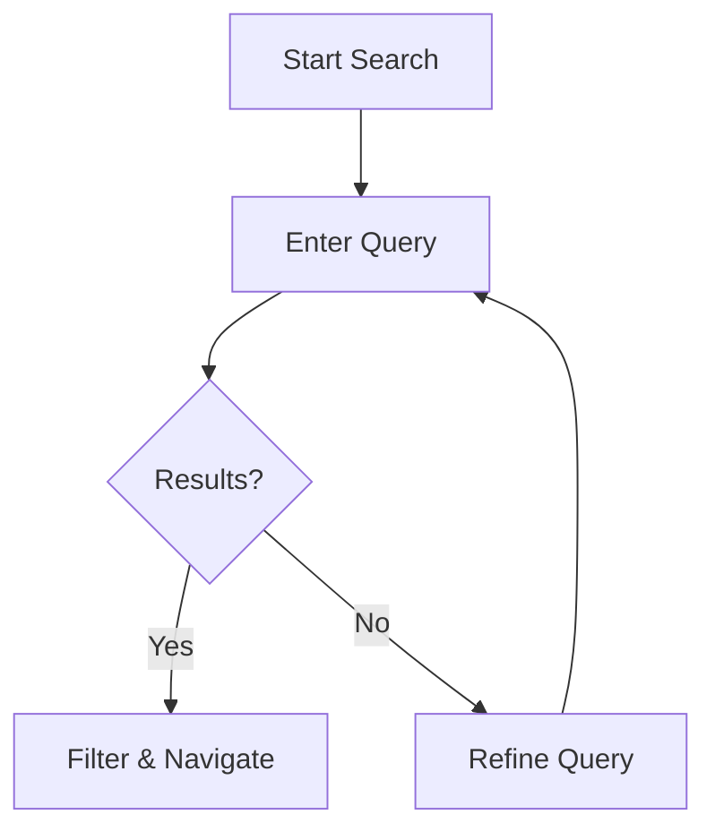

## Overview

Inuba provides powerful tools to manage your project's documentation efficiently. You can edit content with rich formatting, collaborate seamlessly with your team, and navigate large documentation spaces using advanced search. This guide covers key workflows to get you started.

<Columns cols={3}>
  <Card title="Edit Docs" icon="edit-3" href="#editing">
    Format your content using MDX syntax.
  </Card>
  <Card title="Collaborate" icon="users" href="#collaboration">
    Work with teams on shared docs.
  </Card>
  <Card title="Search & Navigate" icon="search" href="#search">
    Find and organize content quickly.
  </Card>
</Columns>

## Editing and Formatting Your Docs

Use Inuba's editor to create and update documentation pages. The built-in MDX support lets you mix Markdown with interactive components.

<Steps>
  <Step title="Create a New Page" icon="plus">
    Navigate to your docs space and click **New Page**. Enter a title and start typing in Markdown or MDX.
  </Step>
  <Step title="Add Formatting" icon="type">
    Use headings, lists, and code blocks. Insert components like `<Callout>` for notes.
  </Step>
  <Step title="Preview Changes" icon="eye">
    Toggle the preview pane to see live rendering. Save when ready.
  </Step>
</Steps>

Here are examples of common formatting patterns:

<CodeGroup tabs="Markdown,MDX">
  ```markdown
  ## Heading

  - List item
  - Another item

  `Inline code`
  ```
  ```jsx
  ## Heading with Component

  <Callout kind="info">
    This is a note.
  </Callout>

  Inline: `{variable}`
  ```
</CodeGroup>

<Callout kind="tip">
  Always preview your page before publishing to catch rendering issues with components like `{tabs}` or `<100ms`.
</Callout>

## Collaboration Workflows

Inuba supports both solo and team editing. Assign permissions to control access.

<Tabs>
  <Tab title="Solo Editing" icon="user">
    For personal projects, enable version history to track changes automatically.

    ```bash
    # Commit changes directly
    git add docs/managing-documentation.mdx
    git commit -m "Update editing guide"
    ```
  </Tab>
  <Tab title="Team Collaboration" icon="users">
    Invite contributors and use pull requests for reviews.

    <Steps>
      <Step title="Invite User">
        Go to **Space Settings > Members** and add emails.
      </Step>
      <Step title="Review Changes">
        Open a PR and comment on specific lines.
      </Step>
    </Steps>
  </Tab>
</Tabs>

## Search and Navigation

Quickly locate content with Inuba's search bar and sidebar navigation.

| Feature | Description | Shortcut |
|---------|-------------|----------|
| Full-Text Search | Finds across all pages | `Ctrl+K` or `/` |
| Breadcrumb Navigation | Shows hierarchy | Sidebar click |
| Tags & Filters | Organize by labels | Add `{["feature", "guide"]}` |

<ExpandableGroup>
  <Expandable title="Advanced Search Tips" default-open="false">
    Use quotes for exact phrases: `"collaboration workflows"`. Filter by tags: `tag:guide`.
  </Expandable>
  <Expandable title="Custom Navigation">
    Edit your sidebar YAML to reorder pages:

    ```yaml
    - label: Guides
      items:
        - Managing Docs
        - Quickstart
    ```
  </Expandable>
</ExpandableGroup>



With these tools, you maintain organized, up-to-date documentation that scales with your project.